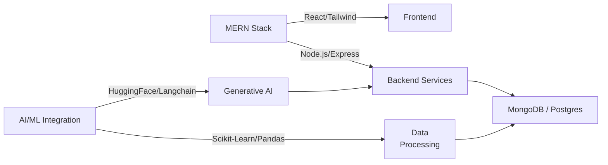

 
   

 

 
   
 

 

 
   
   
   

 --- 
 
### About Me: 
**What I Build**   
Full-stack web applications and AI-driven platforms. Specializing 
in the MERN stack and integrating intelligent ML models using 
Scikit-Learn, LightGBM, and Langchain into user-centric products. 
**Technical Expertise**   - **Frontend Development**: React.js, TailwindCSS, HTML, CSS for 
creating responsive and dynamic UIs. - **Backend Development**: Node.js, Express.js architecture, 
RESTful API design, and JWT Authentication. - **AI/ML & Data**: Predictive modeling, feature engineering using 
Python, Pandas, NumPy, Scikit-learn, and HuggingFace APIs. - **Competitive Programming**: Strong grasp of Data Structures and 
Algorithms with over 500+ problems solved across major platforms. 
**Open to Collaborate On**   
Innovative web applications, AI/ML integrations, Hackathons, open
source development, and projects emphasizing scalability and 
performance. 
**Currently Advancing In**   
Generative AI implementations, LangChain, FAISS, Docker 
containerization, and advanced backend optimization techniques. 
**Technical Discussions**   
Data Structures & Algorithms, Object-Oriented Programming, 
Database Management Systems (MongoDB, PostgreSQL), Machine 
Learning workflows, and Web Development best practices. 
**Engineering Philosophy**   
Analyze data deeply, optimize creatively, design responsively, and 
never stop competing and learning in the coding community. 
**Reach Me**: gautamchhavi13@gmail.com 
  --- 
## Connect With Me: 

 
   
 
 
 
 
 

 
## Tech Stack: 

 
### Languages 
  
 
 
### Frontend Development 
 
 
 
 
### Backend & APIs 
 
 
 
### Databases 
 
 
 
 
### AI/ML & Data Science 
 
 
 
 
### DevOps & Tools 
 
 
 
 
 
 

 --- 
## Engineering Expertise & Technical Focus 

 
### Development Architecture 

 
### Technical Problem Solving 

 
| **Data Structures** | **Algorithms** | **AI/ML** | **Backend** | 
|:---:|:---:|:---:|:---:| 
| Trees, Graphs, Heaps | Dynamic Programming | Feature Engineering 
| RESTful APIs | 
| Hash Tables, Tries | Graph Algorithms | Model Evaluation | Token 
Authentication | 
| Linked Lists, Stacks | Sorting & Searching | Regression/
Classification| Database Design | 

 --- 
## Contribution Graph 

 
   
 

 --- 

 
   
### "Strive for progress, not perfection." 
 

 
 
